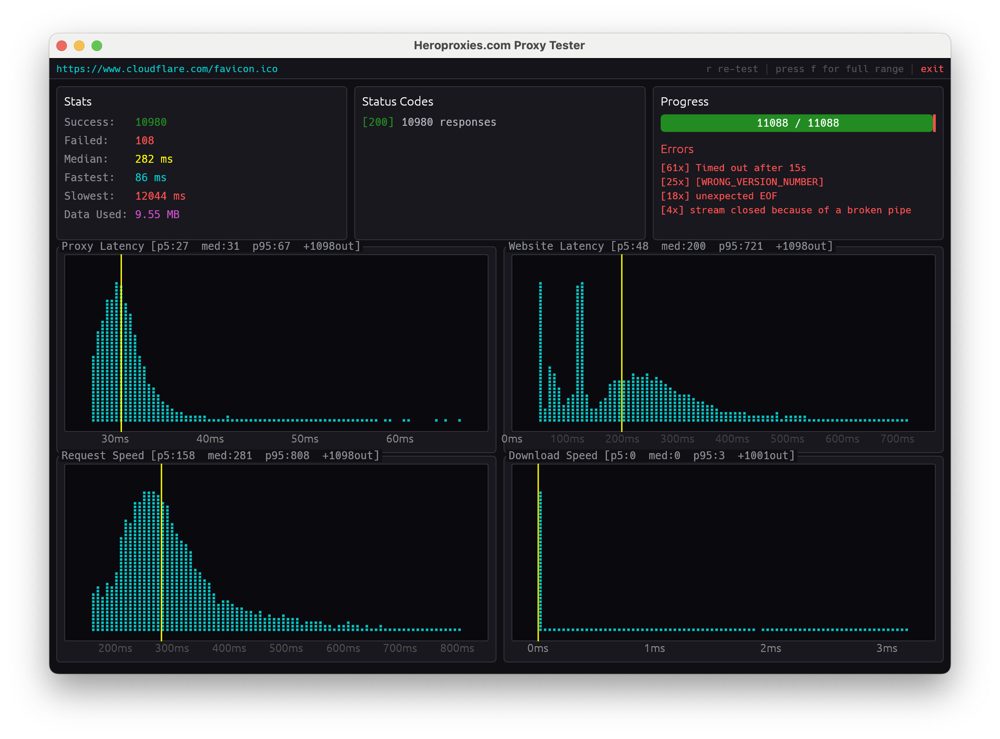

# Hero Proxy Tester

**The fastest, most accurate proxy tester ever built. Test millions of proxies in seconds — and see exactly how good each one is.**

Made by [HeroProxies.com](https://heroproxies.com) — the most cost-effective, high-quality wholesale proxies on the market.



---

## Why this exists

Most proxy "checkers" tell you one thing: alive or dead. That's not enough. A proxy that *connects* can still be slow, blocked by your target site, sitting on the wrong continent, or flagged as a datacenter IP the moment it touches a real website.

Hero Proxy Tester answers the questions that actually matter:

- **Does it work?** — tested against a real site with a real browser fingerprint, so you get the same answer the site would give.
- **How fast is it — for *your* site?** — every proxy is timed end to end and ranked, so you can pull the fastest ones for production.
- **What *is* it?** — ASN, network operator, connection type (cellular, datacenter, corporate, cable/DSL, satellite), and city/region for every working proxy.
- **Where are the bottlenecks?** — the timing is broken into four phases so you can see *why* a proxy is slow, not just *that* it is.

It runs as a native desktop app on **Windows and macOS**, and is engineered to push enormous proxy lists through in a single run.

## Features

### Test millions of proxies in seconds
Massive engine with bounded concurrency and maximum tuning. Point it at a list with hundreds of thousands of lines and watch the dashboard fill in live.

### Accurate results with a real browser fingerprint
Authentic TLS + HTTP/2 fingerprint (real cipher suites, extension ordering, HTTP/2 settings, GREASE) plus live, rotating Chrome user-agents and client-hint headers (`sec-ch-ua`, platform, mobile). Sites can't tell the test apart from a real browser — so a proxy that *looks* working here actually works in the wild. No false "working" results from sites that quietly block bots.

### Deep proxy inspection
For every proxy, pull detailed intelligence:
- **ASN + network operator** (e.g. `AS7922 Comcast Cable`)
- **Connection type** — cellular, cable/DSL, corporate, datacenter, satellite, dialup
- **City / region** (subdivision) location
- **CGNAT detection** — flags carrier-grade NAT ranges
- **Egress location** — which edge/datacenter actually served the request (where your proxy *really* exits the network)

### Four-phase speed breakdown
Every request is timed across the four things that happen on every proxied request:

1. **Reaching the proxy** — how far *you* are from the proxy (your hop to it).
2. **Proxy → website** — how far the *proxy* is from your target site (also how long it takes to authenticate).
3. **Time to first reply** — how long the site takes to start responding.
4. **Download time** — how long it takes to actually pull the data down.

Each phase gets its own live histogram, so a slow proxy tells you *which* leg is the problem. See the [Proxy Tester Manual](docs/README.md) for a plain-English walkthrough of every graph.

### Organized exports
Results are written to a timestamped `results/` folder as you go — no waiting for the run to finish:

- **Sorted by HTTP status code** (`200/`, `403/`, …), each with an `all.txt`
- **Bucketed by speed** — `100ms.txt`, `200ms.txt`, … `4000ms.txt` — so you can grab "all proxies under 200ms to my site" instantly
- **`failed.txt`** for everything that didn't pass
- **Deep-inspect CSVs** with full per-proxy data, plus pre-filtered lists by connection type: `cellular`, `corporate`, `cable-dsl`, `satellite`, and `cgnat`

## Download

Grab a prebuilt binary from the [**Releases**](https://github.com/hero-proxies/proxy-tester/releases/latest) page:

| Platform | File |
|---|---|
| Windows (x64) | `hero-proxy-tester-x86_64-pc-windows-msvc.exe` |
| macOS (Apple Silicon) | `hero-proxy-tester-aarch64-apple-darwin` |

No install, no dependencies. Download, run, drop in your proxy list.

> **macOS:** the binary is unsigned, so the first launch may need `System Settings → Privacy & Security → Open Anyway`, or run `xattr -d com.apple.quarantine ./hero-proxy-tester-*` once.
>
> **Windows:** on first run the app offers a one-time TCP tuning step so it can hold huge numbers of concurrent connections. It's optional — skip it and the tester still works.

### Proxy file format

One proxy per line. Blank lines are ignored.

```
host:port
host:port:username:password
```

Both HTTP and HTTPS proxies are supported (tested via HTTP `CONNECT` tunneling). Authenticated proxies use Basic auth automatically.

## The four phases, in one picture

```
   You ──①──▶ Proxy ──②──▶ Website ──③──▶ (first byte) ──④──▶ (full download)
        reach        proxy→site      time to            download
        the proxy                    first reply         time
```

A great proxy is fast on **all four**. The dashboard shows you, at a glance, which proxies are — and which ones to throw away. Full guide: [docs/](docs/README.md).

## About HeroProxies

[HeroProxies.com](https://heroproxies.com) provides high-quality wholesale proxies at the most competitive prices around. This tester is the same tooling we use internally to vet proxy quality — now public so you can verify exactly what you're getting, from anyone.

---

<sub>Built with Rust 🦀 · [heroproxies.com](https://heroproxies.com)</sub>
